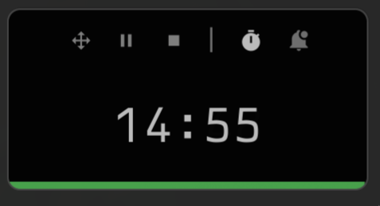

# Rsmodoro Timer

A simple Pomodoro timer application built with Rust and Slint.



## Features

- **Timer**: Pomodoro timer with customizable work and rest durations
- **Alarm**: Set alarms to notify you at specific times

## Usage

Run the application:
```bash
cargo run
```

The timer includes work sessions, rest breaks, and plays sound notifications when phases complete.

## Config
```json
{
  "timer_duration_minutes": 1,
  "rest_duration_minutes": 5,
  "alarm_hour": 21,
  "alarm_min": 5,
  "theme": {
    "background_color": "#000000",
    "input_bg_color": "#111111",
    "text_color": "#cccccc",
    "text_dim_color": "#777777",
    "icon_color": "#888888",
    "accent_color": "#4CAF50",
    "accent_rest_color": "#2196F3",
    "font_family": "TX02 Nerd Font",
    "transparent": false,
    "border_radius": 8,
    "window_width": 300,
    "window_height": 150
  }
}
```

## WM hooks
Hyperland `windows.conf`
```conf
windowrule = float on, match:title rsmodoro
windowrule = pin on, match:title rsmodoro
windowrule = no_initial_focus on, match:title rsmodoro
windowrule = no_dim on, match:title rsmodoro
windowrule = move (monitor_w-window_w-40) (monitor_h/2-window_h/2), match:title rsmodoro
```

## Windows build
```shell
cargo build --release --target x86_64-pc-windows-gnu
```
